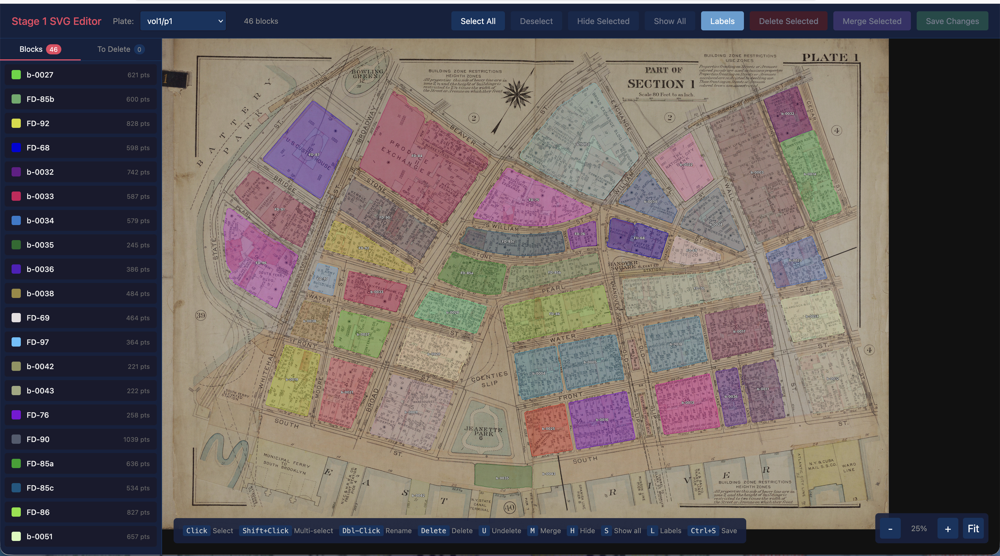
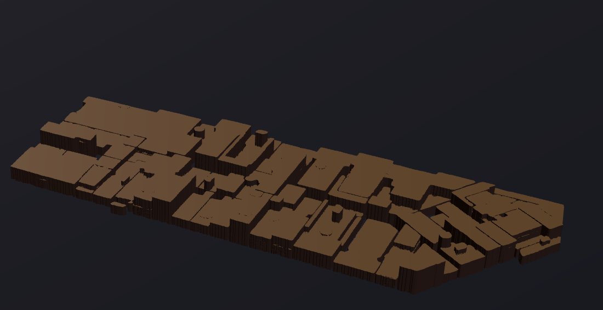

# Segment A City

This collection of scripts is what I am using to process early 1900s Manhattan survey imagery into 3D models in an attempt to create a moderately realistic base layer showing Manhattan in the 1920s

This project was inspired by [New York Noir](https://www.nynoir.org), set in the same time period (and for which I have built an interactive map tool)

## Source Data

The source data for this project is the G.W. Bromley and Co "Atlas of the city of New York Borough of Manhattan", a 5 volume set showing the individual buildings and their heights in Manhattan in the early 1900s.

- [Volume 1](https://archive.org/details/atlas_city_of_new_york_manhattan01phil/page/n1/mode/2up)

## Approach

The general approach of this project is:

1. Extract the individual Plates from the book
2. Analyse each plate with Segment Anything. Firstly, do this against the overall Plate to identify city blocks
3. Use a custom editor to fixup issues with the Segment Anything results
4. Next, extract smaller per-block sub-images and then run them through Segment Anything to produce building outlines
5. Perform correction on these (given the larger volume, the goal is to automate this step as much as possible)
6. Extrude the 2D building shapes into 3D (with height data initially randomly selected, but the goal is to extract height data annotated within the Atlas)
7. Stitch the blocks together, placing them in their correct location per the EPSG:2263 (NY State Plane) projection

I'm currently at Stage 3/4.

## Screenshots

